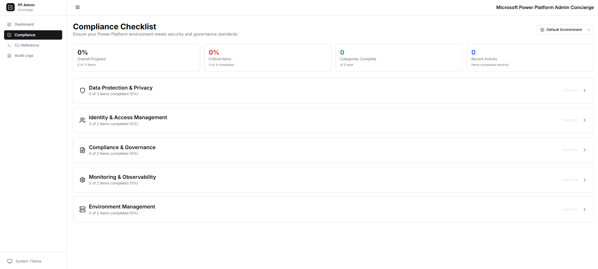
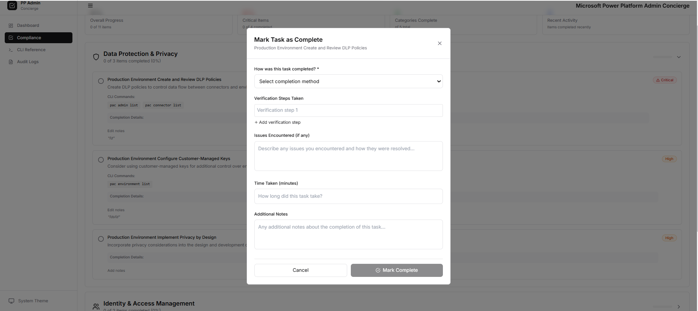

# Microsoft Power Platform Admin Concierge

A modern, comprehensive compliance checklist and monitoring dashboard for Microsoft Power Platform administrators.

## Table of Contents

- [Features](#features)
- [Screenshots](#screenshots)
  - [1. Compliance Dashboard Overview](#1-compliance-dashboard-overview)
  - [2. Interactive Compliance Checklist](#2-interactive-compliance-checklist)
  - [3. Checklist Management Interface](#3-checklist-management-interface)
  - [4. Task Reporting Module](#4-task-reporting-module)
  - [5. Task Completion Methods](#5-task-completion-methods)
  - [6. Power Platform CLI Command Reference](#6-power-platform-cli-command-reference)
  - [7. Comprehensive Audit Logging](#7-comprehensive-audit-logging)
- [Architecture](#architecture)
- [Quick Start](#quick-start)
- [Power Platform CLI Integration](#power-platform-cli-integration)
- [Environment-Specific Compliance Tracking](#environment-specific-compliance-tracking)
- [Compliance Areas Covered](#compliance-areas-covered)
- [Development](#development)
- [Deployment](#deployment)
- [Current Status](#current-status-✅)
- [Contributing](#contributing)
- [License](#license)
- [Support](#support)

## Features

- 🔍 **Compliance Checklist**: Interactive checklist based on Microsoft Power Platform security and governance best practices
- 🌍 **Environment-Specific Tracking**: Track compliance separately for different Power Platform environments (Dev, Staging, Production)
- 📊 **Modern Dashboard**: Real-time insights into your Power Platform tenant health with environment filtering
- 🛠️ **CLI Documentation**: Integrated Power Platform CLI commands and documentation
- 💾 **Persistent Backend**: Track compliance status and store historical data with audit logging
- 🔐 **Security Focused**: Built with Azure security best practices
- 📱 **Responsive Design**: Modern UI that works on all devices

## Screenshots

### 1. Compliance Dashboard Overview


The main dashboard provides a comprehensive overview of your Power Platform compliance status, featuring:
- **Environment Selector**: Switch between different Power Platform environments (Development, Staging, Production)
- **Compliance Score**: Real-time compliance percentage with visual indicators
- **Health Metrics**: Key performance indicators and system health status
- **Recent Activity**: Timeline of recent compliance activities and updates
- **Quick Actions**: Fast access to common administrative tasks

### 2. Interactive Compliance Checklist


The compliance checklist interface offers:
- **Categorized Items**: Organized compliance requirements by security domains
- **Progress Tracking**: Visual indicators showing completion status for each item
- **Environment Filtering**: View compliance items specific to selected environments
- **Detailed Descriptions**: Comprehensive guidance for each compliance requirement
- **Notes and Comments**: Add contextual information and implementation notes

### 3. Checklist Management Interface


Advanced checklist management capabilities include:
- **Bulk Operations**: Mark multiple items as complete or update statuses
- **Category Organization**: Group related compliance items for better organization
- **Priority Levels**: Assign and filter by priority (High, Medium, Low)
- **Due Date Tracking**: Set and monitor compliance deadlines
- **Assignment Features**: Assign compliance tasks to team members

### 4. Task Reporting Module


Comprehensive reporting and analytics features:
- **Compliance Reports**: Generate detailed compliance status reports
- **Trend Analysis**: Historical compliance data and progress tracking
- **Export Capabilities**: Export reports in various formats (PDF, Excel, CSV)
- **Custom Filters**: Filter reports by environment, category, date range, or status
- **Executive Summaries**: High-level overviews for management reporting

### 5. Task Completion Methods


Flexible task completion workflows:
- **Multiple Completion Options**: Various ways to mark tasks as complete
- **Evidence Upload**: Attach documentation and evidence for compliance items
- **Approval Workflows**: Multi-step approval processes for critical compliance items
- **Automated Checks**: Integration with Power Platform APIs for automatic validation
- **Review Process**: Structured review and verification procedures

### 6. Power Platform CLI Command Reference


Integrated Power Platform CLI documentation:
- **Searchable Commands**: Quickly find relevant Power Platform CLI commands
- **Command Categories**: Organized by functional areas (environments, solutions, connectors, etc.)
- **Copy-to-Clipboard**: One-click copying of command syntax
- **Usage Examples**: Practical examples with real-world scenarios
- **Parameter Documentation**: Detailed explanation of command parameters and options

### 7. Comprehensive Audit Logging


Complete audit trail and logging system:
- **Activity Tracking**: Detailed logs of all system activities and user actions
- **Environment Context**: All activities tracked with specific environment information
- **User Attribution**: Track which users performed which actions
- **Timestamp Information**: Precise timing of all compliance activities
- **Search and Filter**: Advanced filtering options for audit log analysis
- **Export Capabilities**: Export audit logs for compliance reporting and analysis

## Architecture

- **Frontend**: React with TypeScript, Tailwind CSS, and shadcn/ui components
- **Backend**: Node.js with Express and TypeScript
- **Database**: SQLite for development, easily configurable for production
- **State Management**: Zustand for client-side state
- **API**: RESTful API with proper error handling and validation

## Quick Start

1. **Install dependencies**:
   ```bash
   npm run install:all
   ```

2. **Start development servers**:
   ```bash
   npm run dev
   ```

3. **Open your browser**:
   - Frontend: http://localhost:3001 (or next available port)
   - Backend API: http://localhost:5000
   - Health Check: http://localhost:5000/health

> **Note**: The frontend will automatically find an available port if 3000 is in use. If port 5000 is occupied by another process, you may need to stop it first.

## Power Platform CLI Integration

The app provides comprehensive documentation and examples for Power Platform CLI commands, including:

- Environment management
- Connector analysis
- Data Loss Prevention (DLP) policy review
- User and security role auditing
- Solution management
- Compliance reporting

## Environment-Specific Compliance Tracking

The application now supports tracking compliance separately for different Power Platform environments:

### **Environment Management**
- **Multiple Environments**: Support for Development, Staging, Production, and custom environments
- **Environment Selector**: Easy switching between environments in the UI
- **Environment-Specific Data**: All compliance items, dashboard metrics, and audit logs are filtered by environment
- **Environment CRUD**: Create, read, update, and delete environments via API

### **Environment-Filtered Views**
- **Dashboard Metrics**: Compliance scores, health metrics, and trends per environment
- **Compliance Checklist**: View and manage checklist items specific to each environment
- **Audit Logging**: All activities are tracked with environment context
- **Historical Data**: Maintain separate compliance history for each environment

### **API Endpoints**
```bash
# Environment management
GET    /api/environments                    # List all environments
POST   /api/environments                    # Create new environment
PUT    /api/environments/:id               # Update environment
DELETE /api/environments/:id               # Delete environment

# Environment-filtered data
GET    /api/compliance/categories?environment_id=dev    # Compliance items for dev
GET    /api/dashboard/overview?environment_id=staging   # Dashboard for staging
GET    /api/compliance/summary?environment_id=prod      # Summary for production
```

## Compliance Areas Covered

### Security & Data Protection
- Data Loss Prevention (DLP) policies
- Customer-managed keys configuration
- Privacy considerations in app development
- Tenant isolation settings
- Network security features
- Microsoft Purview integration
- Dataverse RBAC security model

### Identity & Access Management
- Identity management strategy
- Administrative access policies
- Environment access controls
- Role-based access control (RBAC)
- Conditional access policies

### Compliance & Governance
- Regulatory standards compliance (GDPR, HIPAA, CCPA, PCI)
- Activity monitoring and auditing
- User education and training
- Documentation and record keeping
- Environment lifecycle management

### Monitoring & Observability
- Tenant-level analytics
- Security score monitoring
- Power Platform Advisor recommendations
- Activity logging and SIEM integration
- Performance monitoring

## Development

### Prerequisites
- Node.js 18+ 
- npm or yarn
- Power Platform CLI (for administrators)

### Environment Variables
Copy `.env.example` to `.env` and configure:
```
NODE_ENV=development
PORT=5000
DATABASE_URL=./data/compliance.db
JWT_SECRET=your-jwt-secret
```

### Database Schema
The application uses a SQLite database with tables for:
- **Environments**: Power Platform environments (Dev, Staging, Production, etc.)
- **Compliance Items**: Checklist items linked to specific environments
- **Compliance Categories**: Groupings for compliance items
- **Audit Logs**: Activity tracking with environment context
- **CLI Commands**: Power Platform CLI reference documentation

### Database Migration
The app includes automatic database migration to add environment support:
```bash
# Run database migration (if needed)
cd backend
node scripts/migrate-database.js
```

### Available Scripts
```bash
# Root level commands
npm run install:all    # Install dependencies for both frontend and backend
npm run dev            # Start both frontend and backend in development mode
npm run build          # Build both frontend and backend for production

# Backend specific (from /backend directory)
npm start              # Start backend server
npm run build          # Build TypeScript to JavaScript
npm run dev            # Start backend in development mode with auto-reload

# Frontend specific (from /frontend directory)  
npm run dev            # Start frontend development server
npm run build          # Build frontend for production
npm run preview        # Preview production build locally

# Database utilities (from /backend directory)
node scripts/migrate-database.js    # Run database migration
node scripts/add-test-data.js       # Add sample compliance items for testing
```

## Deployment

### Azure App Service (Recommended)
1. Build the application: `npm run build`
2. Deploy using Azure CLI or GitHub Actions
3. Configure environment variables in Azure

### Docker
```bash
docker build -t mspp-admin-concierge .
docker run -p 3000:3000 mspp-admin-concierge
```

## Current Status ✅

The application is **fully functional** with the following features implemented:

### ✅ **Completed Features**
- **Environment-Specific Compliance**: Track compliance separately for different Power Platform environments
- **Environment Selector**: Dropdown to switch between environments in Dashboard and Compliance views
- **Dashboard**: Real-time compliance overview, health metrics, and recent activity with environment filtering
- **Compliance Checklist**: Interactive checklist with categories, completion tracking, and notes per environment
- **CLI Reference**: Searchable Power Platform CLI documentation with copy-to-clipboard
- **Audit Logs**: Activity tracking with environment context and filtering
- **Environment Management API**: CRUD operations for managing environments
- **Backend API**: RESTful endpoints for all data operations with environment support
- **Database**: SQLite with pre-populated compliance items, environments, and CLI commands
- **Responsive UI**: Modern, accessible interface with dark/light mode support

### 🏗️ **Architecture Overview**
- **Frontend**: React 18 + TypeScript + Vite + Tailwind CSS (Port 3001)
- **Backend**: Node.js + Express + TypeScript + SQLite (Port 5000)
- **Database**: SQLite with automatic initialization, migrations, and sample data
- **State Management**: Zustand for client-side state with environment context
- **API Communication**: Axios with error handling and toast notifications

### 🔧 **Troubleshooting**

**Port Conflicts**: If you see port conflicts, the app will automatically find available ports:
- Frontend: Tries 3000 → 3001 → 3002 → 3003, etc.
- Backend: Uses port 5000 (kill existing processes if needed)

**Backend Port 5000 Already In Use**:
```bash
# On Windows (PowerShell)
netstat -ano | findstr :5000
taskkill /F /PID <process_id>

# Then restart the backend
cd backend
npm start
```

**Database Migration Issues**: If you encounter database errors, run the migration:
```bash
cd backend
node scripts/migrate-database.js
```

**API Connection Issues**: Ensure both servers are running:
```bash
# Check if services are running
curl http://localhost:5000/health
# Should return: {"status":"healthy",...}

# Test environment API
curl http://localhost:5000/api/environments
# Should return list of environments
```

**Frontend Build Errors**: All TypeScript errors have been resolved. If you encounter issues:
```bash
cd frontend
npm run build  # Should complete without errors
```

**Environment Data Not Loading**: Verify the database has environment data:
```bash
cd backend
node scripts/add-test-data.js  # Adds sample data for different environments
```

## Contributing

1. Fork the repository
2. Create a feature branch
3. Make your changes
4. Add tests if applicable
5. Submit a pull request

## License

MIT License - see LICENSE file for details

## Support

For questions or issues:
- Check the documentation in `/docs`
- Review Power Platform CLI documentation
- Contact your organization's Power Platform admin team
